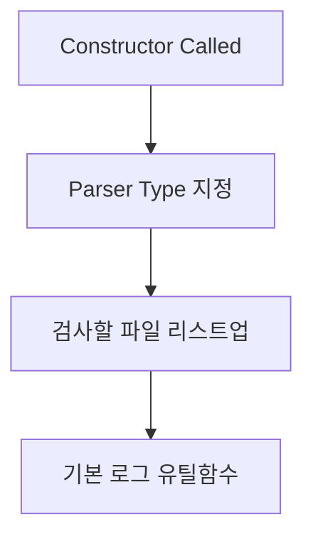
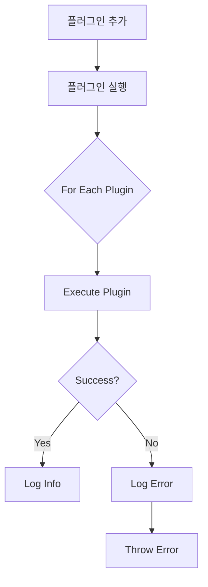
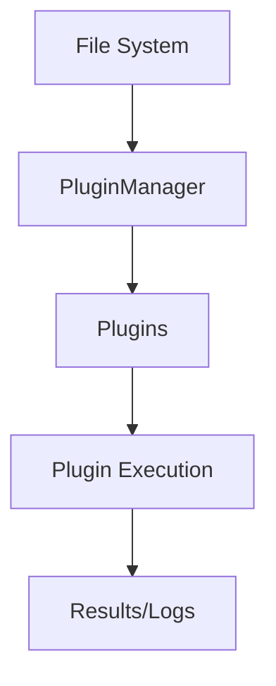

## 초기화

```mermaid
graph TD
    A[Constructor Called] --> B[Parser Type 지정]
    B --> C[검사할 파일 리스트업]
    C --> D[기본 로그 유틸함수]
```

## ㅇㄹㄴ

```mermaid
graph TD
    A[플러그인 추가] --> B[플러그인 실행]
    B --> C{For Each Plugin}
    C --> D[Execute Plugin]
    D --> E{Success?}
    E -->|Yes| H[Log Info]
    E -->|No| F[Log Error]
    F --> G[Throw Error]
```

## abc

```mermaid
graph TD
    A[File System] --> B[PluginManager]
    B --> C[Plugins]
    C --> D[Plugin Execution]
    D --> E[Results/Logs]
```